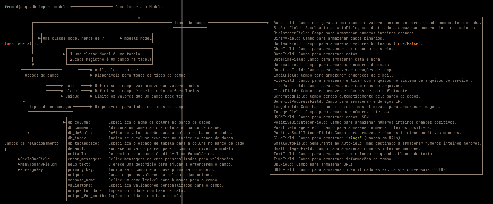

# Midmap-Django-models
 Django models serve as a crucial component of the Django web framework, providing a high-level, Pythonic way to define the structure and behavior of the application's database. Models define the data schema, encapsulate business logic, and facilitate the interaction between the web application and the underlying database.

 #  Midmap
 

